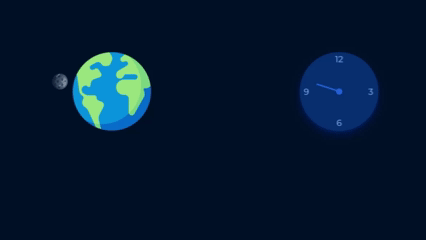

# 🌍 Orbit & Clock (CSS Only)

Two mini projects in one: a CSS orbit animation and a CSS clock.

1. **Earth-Moon Orbit**  
   The Moon orbits around the Earth using only CSS keyframes and transforms.

2. **Clock**  
   A simple clock face with numbers.

---

## 📸 Preview

---

## 🚀 Live Demo
[Live Demo](https://gamalhafez.github.io/css-animation-showcase/)

---

## 🛠️ Built With
- HTML5  
- CSS3 (keyframes, transform)

---

## 🎯 Purpose
This project was made to practice **CSS animations** and combining multiple mini projects into one page.
